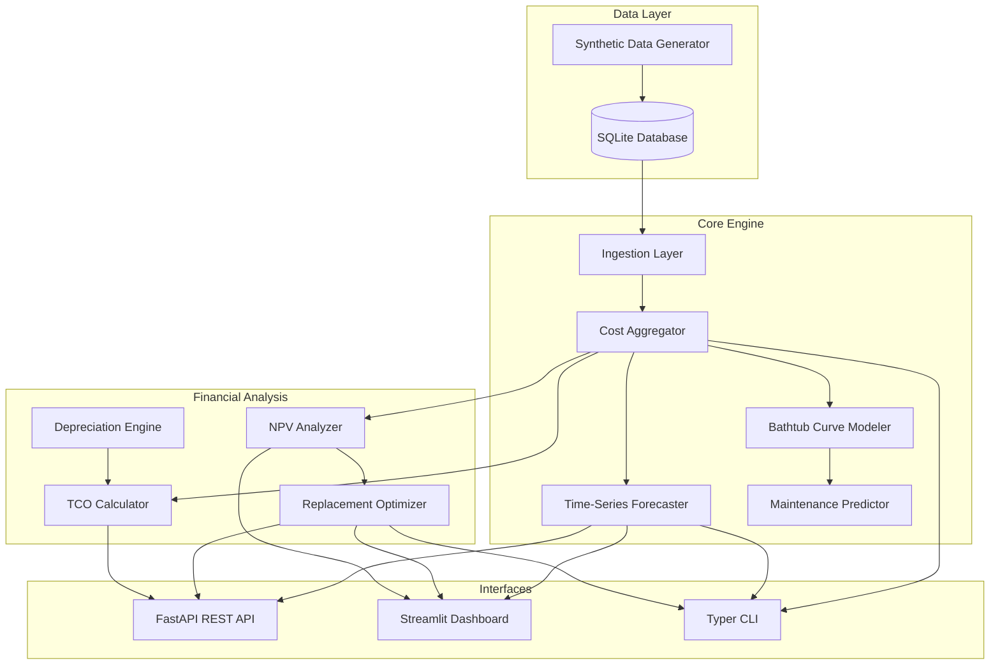

# equipcost-forecast

[](https://github.com/your-org/equipcost-forecast/actions/workflows/ci.yml)
[](.)
[](https://www.python.org/)
[](LICENSE)

## Problem Statement

Healthcare facilities manage fleets of expensive biomedical equipment—CT scanners, MRIs, ventilators, infusion pumps—where maintenance costs escalate unpredictably as assets age. Capital planners lack data-driven tools to answer critical questions: *When does repairing equipment cost more than replacing it? Which assets should be prioritized for replacement within a constrained budget? What will maintenance spend look like over the next 3 years?*

**equipcost-forecast** addresses this gap by combining time-series cost forecasting, bathtub-curve failure modeling, and NPV-based repair-vs-replace analysis into a single platform that turns maintenance history into actionable capital planning decisions.

## Key Features

- **Time-Series Cost Forecasting** — ARIMA and Exponential Smoothing models with automatic method selection and confidence intervals
- **Bathtub Curve Failure Modeling** — Weibull-based early-life/wear-out failure rate estimation with remaining useful life prediction
- **Repair vs. Replace Analysis** — NPV comparison of continued operation against new equipment acquisition with configurable discount rates
- **Fleet Replacement Optimizer** — Ranks all assets by replacement priority and generates multi-year capital schedules within budget constraints
- **Total Cost of Ownership (TCO)** — Comprehensive lifecycle costing including acquisition, maintenance, downtime, and depreciation (straight-line and MACRS)
- **Synthetic Data Generator** — Realistic fleet of 500 biomedical assets across 5 facilities with escalating maintenance patterns
- **REST API** — Versioned FastAPI endpoints for equipment, forecasts, financials, and fleet analytics
- **Interactive Dashboard** — Streamlit app with fleet overview, equipment detail, cost history charts, and forecast fan charts
- **CLI** — Full command-line interface for data loading, aggregation, forecasting, analysis, and reporting

## Architecture



## Quick Start

### Prerequisites

- Python 3.11+
- pip or a compatible package manager

### Installation

```bash
git clone https://github.com/your-org/equipcost-forecast.git
cd equipcost-forecast
python -m venv .venv
source .venv/bin/activate
pip install -e ".[dev]"
```

### Load Data and Run

```bash
# Initialize database and load synthetic data
python -m equipcost_forecast load-data

# Compute monthly cost rollups
python -m equipcost_forecast aggregate

# Run a 36-month cost forecast
python -m equipcost_forecast forecast --horizon 36

# Repair-vs-replace analysis
python -m equipcost_forecast analyze --facility FAC-001

# Fleet cost report
python -m equipcost_forecast report
```

### Docker

```bash
docker compose up
# API: http://localhost:8000/docs
# Dashboard: http://localhost:8501
```

## Usage Examples

### CLI

```bash
# Forecast for a specific equipment item
python -m equipcost_forecast forecast --equipment-id 42 --horizon 24 --method arima

# Analyze replacement priorities with a $1M budget
python -m equipcost_forecast analyze --budget 1000000

# Start the API server
python -m equipcost_forecast serve --port 8000

# Launch the dashboard
python -m equipcost_forecast dashboard --port 8501
```

### REST API

```bash
# Health check
curl http://localhost:8000/api/v1/health

# List equipment with filters
curl "http://localhost:8000/api/v1/equipment?equipment_class=ct_scanner&limit=10"

# Generate forecasts
curl -X POST http://localhost:8000/api/v1/forecasts/generate \
  -H "Content-Type: application/json" \
  -d '{"asset_tag": "EQ-0001", "horizon": 36}'

# Get TCO report
curl "http://localhost:8000/api/v1/financial/tco/EQ-0001"

# Repair vs. replace analysis
curl "http://localhost:8000/api/v1/financial/repair-vs-replace/EQ-0001"

# Fleet replacement priorities
curl "http://localhost:8000/api/v1/fleet/replacement-priorities"

# Depreciation schedule
curl "http://localhost:8000/api/v1/financial/depreciation/EQ-0001?method=macrs"
```

### Python

```python
from equipcost_forecast.models.database import get_engine, get_session
from equipcost_forecast.forecasting.cost_aggregator import CostAggregator
from equipcost_forecast.forecasting.time_series import CostForecaster
from equipcost_forecast.financial.npv_analyzer import NPVAnalyzer

engine = get_engine()
with get_session(engine) as session:
    # Aggregate costs
    agg = CostAggregator(session)
    agg.compute_monthly_rollups()

    # Forecast
    forecaster = CostForecaster()
    result = forecaster.forecast_equipment(1, session, horizon=36)
    print(f"Method: {result.method}, MAE: ${result.metrics.mae:,.2f}")

    # Repair vs. replace
    analyzer = NPVAnalyzer()
    decision = analyzer.repair_vs_replace(1, session)
    print(f"Recommendation: {decision.recommended_action}")
    print(f"NPV Savings: ${decision.npv_savings:,.0f}")
```

## Project Structure

```
equipcost-forecast/
├── src/equipcost_forecast/
│   ├── api/                    # FastAPI application
│   │   ├── main.py             # App factory, lifespan, CORS
│   │   ├── dependencies.py     # Database session dependency
│   │   └── routes/
│   │       ├── equipment.py    # Equipment CRUD + cost history
│   │       ├── forecasts.py    # Forecast generation + retrieval
│   │       ├── financial.py    # TCO, NPV, depreciation endpoints
│   │       └── fleet.py        # Fleet health + replacement priorities
│   ├── config/
│   │   └── settings.py         # Pydantic settings (EQUIPCOST_ prefix)
│   ├── dashboard/
│   │   └── app.py              # Streamlit two-page dashboard
│   ├── financial/
│   │   ├── depreciation.py     # Straight-line + MACRS depreciation
│   │   ├── npv_analyzer.py     # NPV/IRR + repair-vs-replace
│   │   ├── replacement_optimizer.py  # Fleet replacement ranking + scheduling
│   │   └── tco_calculator.py   # Total cost of ownership
│   ├── forecasting/
│   │   ├── bathtub_curve.py    # Weibull failure rate modeling
│   │   ├── cost_aggregator.py  # Monthly cost rollups from work orders
│   │   ├── maintenance_predictor.py  # MTBF + next failure prediction
│   │   └── time_series.py      # ARIMA + Exponential Smoothing
│   ├── ingestion/
│   │   ├── equipment_loader.py # Equipment registry queries
│   │   ├── work_order_loader.py # Work order queries with filters
│   │   └── contract_loader.py  # Service contract + PM schedule queries
│   ├── models/
│   │   ├── orm.py              # SQLAlchemy 2.0 ORM models (8 tables)
│   │   ├── schemas.py          # Pydantic v2 response schemas
│   │   └── database.py         # Engine, session factory, init
│   └── cli.py                  # Typer CLI (9 commands)
├── scripts/
│   └── generate_data.py        # Synthetic data generator (500 assets)
├── tests/
│   ├── conftest.py             # Fixtures with realistic lifecycle data
│   ├── unit/                   # Unit tests for all modules
│   └── integration/            # API + full pipeline tests
├── .github/workflows/ci.yml    # GitHub Actions CI
├── Dockerfile                  # Multi-stage Docker build
├── docker-compose.yml          # API + Dashboard services
├── pyproject.toml              # Project config + tool settings
└── .env.example                # Environment variable template
```

## Testing

```bash
# Run all tests
pytest tests/ -v

# Run with coverage
pytest tests/ --cov=src/equipcost_forecast --cov-report=term-missing

# Run only unit tests
pytest tests/unit/ -v

# Run only integration tests
pytest tests/integration/ -v
```

The test suite includes 120 tests with 83% code coverage:

- **Unit tests**: Financial calculations (NPV, IRR, depreciation, TCO), time-series forecasting, bathtub curve fitting, cost aggregation, ingestion loaders, CLI commands, configuration
- **Integration tests**: Full API endpoint testing, end-to-end pipeline from data loading through forecasting to replacement analysis

## Tech Stack

| Layer | Technology |
|-------|-----------|
| Language | Python 3.11+ |
| ORM | SQLAlchemy 2.0 (mapped_column) |
| Database | SQLite (configurable via DATABASE_URL) |
| API | FastAPI + Uvicorn |
| Dashboard | Streamlit + Plotly |
| CLI | Typer + Rich |
| Forecasting | statsmodels (ARIMA, Holt-Winters) |
| Curve Fitting | scipy.optimize.curve_fit |
| Data | pandas, numpy |
| Schemas | Pydantic v2 |
| Config | pydantic-settings |
| Testing | pytest, pytest-cov |
| Linting | ruff, black, isort |
| Type Checking | mypy |
| CI/CD | GitHub Actions |
| Container | Docker (multi-stage) |

## License

This project is licensed under the MIT License. See [LICENSE](LICENSE) for details.
